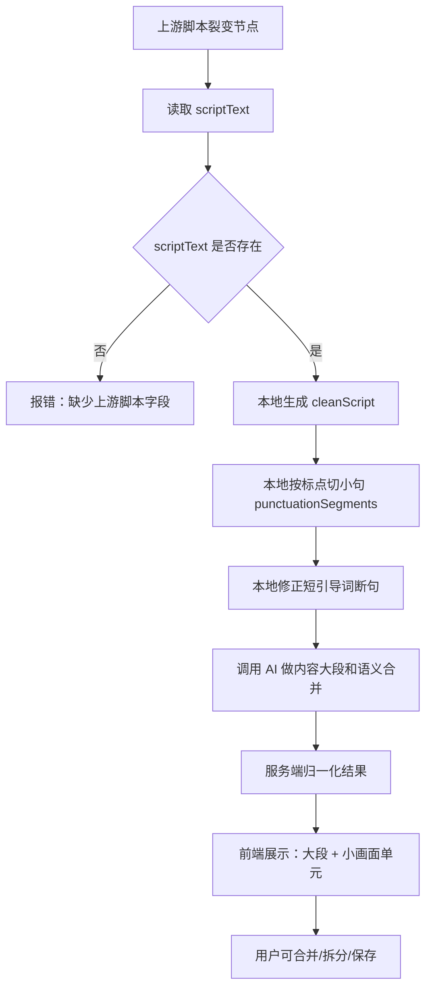

# 脚本拆解节点底层逻辑架构

更新时间：2026-07-22

## 1. 节点定位

脚本拆解节点只负责一件事：把上游产出的纯净口播脚本，拆成方便后续素材匹配和剪辑使用的结构。

它不负责：

- 生成新脚本。
- 推荐具体素材。
- 分析画面细节。
- 生成字幕、语音或时间轴。
- 输出解释性长文本。

核心目标是让后续节点拿到两个稳定结果：

- `cleanScript`：纯净口播脚本，可直接传给 TTS / 字幕节点。
- `contentBlocks + visualUnits`：内容大段和画面基础单元，可传给素材处理节点。

## 2. 上游输入要求

脚本拆解节点只接收上游节点里的 `scriptText` 字段。

如果上游没有 `scriptText`，节点直接报错，不再尝试从一大段 JSON 或展示文本里清洗脚本。

这样做的原因：

- 节点职责更单一。
- 避免脚本拆解节点承担复杂清洗逻辑。
- 保证工作流稳定，减少脏字段传递。
- 文本裂变节点必须对自己的输出负责，只产出干净脚本。

当前输入示例：

```json
{
  "scriptText": "红旗智驾，让你的出行从此告别焦虑。这套系统搭载了高清度激光雷达和多个摄像头..."
}
```

## 3. 总体处理流程



## 4. 本地确定性处理

### 4.1 生成 cleanScript

服务端会先把 `scriptText` 转成 `cleanScript`。

当前规则：

- 去掉空格、换行、制表符。
- 保留中文标点。
- 不做复杂语义清洗。

注意：这里不是主要清洗环节。真正的干净脚本应该由上游脚本裂变节点产出。

### 4.2 按标点切小句

本地先按标点切出最小文本小段，形成 `punctuationSegments`。

主要分隔符：

- 逗号：`，`
- 句号：`。`
- 问号：`？`
- 叹号：`！`
- 分号：`；`
- 英文标点兜底：`, . ? ! ;`

输出示例：

```json
[
  {
    "id": "seg-001",
    "order": 1,
    "text": "红旗智驾，",
    "delimiter": "，"
  },
  {
    "id": "seg-002",
    "order": 2,
    "text": "让你的出行从此告别焦虑。",
    "delimiter": "。"
  }
]
```

### 4.3 短引导词预合并

这是为了解决一个重要问题：

按逗号切句时，容易把短实体词错误切成独立画面，比如：

```text
红旗智驾，让你的出行从此告别焦虑。
```

如果直接切，会变成：

- `红旗智驾，`
- `让你的出行从此告别焦虑。`

这不符合语义。`红旗智驾` 不是一个独立表达，它是后一句谓语和价值表达的主语/引导对象。

所以本地加入预合并规则：

- 当前小句以逗号结尾。
- 当前小句较短。
- 当前小句没有明显谓语。
- 后一句以 `让 / 使 / 把 / 给 / 以 / 为 / 从此 / 会 / 能 / 是 / 成为 / 带来 / 实现 / 告别` 等谓语或价值表达开头。

满足时，本地先合并成一个 `punctuationSegment`：

```text
红旗智驾，让你的出行从此告别焦虑。
```

这个规则的目的不是替代 AI，而是避免 AI 从错误的小句边界开始判断。

## 5. AI 负责什么

AI 不再生成素材建议，也不输出解释原因。

AI 只做两件事：

1. 把小句归入内容大段 `contentBlocks`。
2. 在每个内容大段内部，把相邻且语义一致的小句合并成 `visualUnits`。

### 5.1 内容大段 contentBlocks

内容大段是脚本结构层，不是素材层。

它表示这一段内容的主旨范围，例如：

- `钩子`
- `痛点引入`
- `技术与功能`
- `场景体验`
- `价值升华`
- `收束`

大段的作用：

- 帮用户理解脚本结构。
- 让后续工作流知道内容处在哪个表达阶段。
- 方便人工检查和调整。

大段不直接等于一个素材容器。

### 5.2 画面单元 visualUnits

画面单元才是后续素材匹配和剪辑的基础单位。

一个 `visualUnit` 可以包含一个或多个 `punctuationSegment`。

例如：

```text
你只需要轻轻握住方向盘，剩下的交给红旗智驾。
```

这两小句表达的是同一个驾驶辅助体验，可以合并为一个 `visualUnit`。

但如果相邻小句表达的是两个不同功能动作，比如：

```text
前方行人突然出现，系统主动预警并刹停。
```

这可能需要拆成更具体的素材单元，取决于后续素材节点是否需要单独匹配画面。

## 6. 素材支撑类型

当前不是简单的“通用 / 专用”二分，而是三层：

### 6.1 general

通用画面。

适合：

- 抽象情绪。
- 价值表达。
- 氛围描述。
- 泛场景表达。

特点：

- 通用素材可支撑。
- 可以和相邻同语义内容合并。
- `mergeLocked=false`。

### 6.2 guided

方向画面。

适合：

- 有品牌名、系统名、场景方向。
- 但没有锁定到某个具体功能动作、参数或部件。

例如：

```text
交给红旗智驾。
红旗智驾陪你开。
```

这类内容有明确方向，但不一定需要某个极具体素材，所以通常是 `guided`，不是 `specific`。

特点：

- 可用方向素材支撑。
- 可以和相邻同语义内容合并。
- `mergeLocked=false`。

### 6.3 specific

专用画面。

适合：

- 具体功能动作。
- 具体参数。
- 具体部件。
- 可验证画面。
- 屏幕文字。
- 微距细节。
- 明确演示动作。

例如：

```text
AEB 自动刹停。
主动预警。
17 寸仪表盘。
汝窑漆面微距。
车标升降。
自动变道。
```

特点：

- 必须由专用素材支撑。
- 不允许随意合并。
- `mergeLocked=true`。

## 7. AI 输出格式

AI 只返回最小 JSON：

```json
{
  "ok": true,
  "type": "script-split-result",
  "contentBlocks": [
    {
      "id": "block-001",
      "order": 1,
      "role": "钩子",
      "segmentIds": ["seg-001", "seg-002"],
      "visualUnits": [
        {
          "id": "unit-001",
          "order": 1,
          "segmentIds": ["seg-001", "seg-002"],
          "mergeByAi": true,
          "materialType": "guided",
          "mergeLocked": false
        }
      ]
    }
  ]
}
```

AI 不需要返回：

- 合并原因。
- 素材推荐。
- 画面描述。
- 解释说明。
- Markdown。
- 面向用户阅读的长文本。

## 8. 服务端归一化

AI 返回后，服务端会统一整理为稳定结构：

```json
{
  "ok": true,
  "type": "script-split-result",
  "cleanScript": "纯净口播脚本",
  "punctuationSegments": [],
  "contentBlocks": [],
  "visualGroups": [],
  "raw": {}
}
```

### 8.1 cleanScript

来自上游 `scriptText`，是纯净口播全文。

### 8.2 punctuationSegments

本地按标点拆出的小句，是所有分组的基础索引。

AI 只能引用这些 `seg-xxx`，不重新改写文本。

### 8.3 contentBlocks

AI 产出的内容大段，经服务端补全：

- `id`
- `order`
- `role`
- `segmentIds`
- `text`
- `visualUnits`

### 8.4 visualGroups

这是为了方便后续节点直接使用，从 `contentBlocks[].visualUnits` 平铺出来的结构。

每个 `visualGroup` 都会带上所属大段信息：

- `blockId`
- `blockOrder`
- `blockRole`
- `blockText`

## 9. 前端交互逻辑

前端展示分两层：

1. 横向或分块展示内容大段。
2. 每个大段内部展示多个小画面单元。

用户可以做两种修改：

- 选择相邻多个未锁定单元，点击合并。
- 选择一个已合并单元，点击拆分。

### 9.1 合并规则

允许合并的条件：

- 必须是相邻单元。
- 必须属于同一个内容大段。
- 不能包含 `mergeLocked=true` 的专用单元。

合并后：

- `segmentIds` 合并。
- `text` 按顺序拼接。
- `mergeByAi=false`，表示这是用户调整结果。
- 默认 `materialType=general`。
- `mergeLocked=false`。

### 9.2 拆分规则

拆分不再调用 AI，本地完成。

如果一个 `visualUnit` 包含多个 `segmentIds`，点击拆分后，会按原始 `punctuationSegments` 拆回多个小单元。

例如：

```text
你只需要轻轻握住方向盘，剩下的交给红旗智驾。
```

拆分后：

- `你只需要轻轻握住方向盘，`
- `剩下的交给红旗智驾。`

## 10. 兜底逻辑

如果 AI 返回非严格 JSON：

- 服务端会记录 warning。
- 使用本地兜底结构。
- 默认把所有小句放进一个内容大段。
- 每个小句单独成为一个 `visualUnit`。

兜底结果可编辑，但质量低于正常 AI 分组结果。

## 11. 当前重点问题

### 11.1 小句边界决定后续质量

如果本地标点切分把语义主体切坏，AI 后续很难稳定修正。

典型问题：

```text
红旗智驾，让你的出行从此告别焦虑。
```

必须保证它不会变成两个独立逻辑。

### 11.2 specific 不能判断过重

不能因为出现品牌名、车型名、系统名，就直接判定专用素材。

`红旗智驾` 这类词通常只是方向约束，应该更多落在 `guided`。

只有出现明确功能动作、参数、部件、演示画面时，才进入 `specific`。

### 11.3 大段不是素材容器

内容大段只是脚本主旨结构。

真正给后续素材节点使用的是 `visualUnits / visualGroups`。

### 11.4 用户修改是必要环节

脚本语义和素材支撑天然存在不确定性，所以节点必须保留人工合并/拆分空间。

这个节点的目标不是一次性绝对正确，而是：

- AI 先给一个相对稳定的初稿。
- 用户低成本修正。
- 修正后的结构保存给下游节点。

## 12. 后续可优化方向

1. 增加更完整的中文短引导词识别规则。
2. 增加“主谓宾完整性”本地辅助判断。
3. 增加最短/最长画面单元字数或预估时长限制。
4. 后续接入 TTS 后，用真实音频时长反推画面单元是否过长。
5. 把素材支撑判断下沉到独立素材节点，脚本拆解节点只保留 `materialType` 粗分类。
6. 给用户提供“一键恢复 AI 初稿”和“一键恢复标点原始拆分”。

